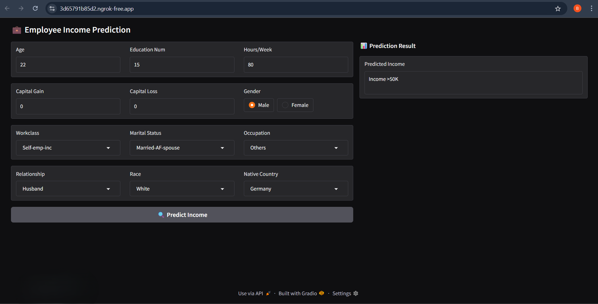

# 💼 Employee Salary Prediction

A machine learning project that predicts whether an employee's income exceeds 50K/year based on demographic and employment features. Built using logistic regression, data preprocessing, and deployed with Gradio for an interactive web interface. Publicly accessible using Ngrok.

---

## 📁 Dataset

The dataset was provided by the mentor for academic purposes and may be based on the UCI Adult dataset (1994 U.S. Census data). It includes features such as:

- Age  
- Education Number  
- Capital Gain  
- Capital Loss  
- Hours Per Week  
- Workclass  
- Marital Status  
- Occupation  
- Relationship  
- Race  
- Native Country  
- Gender  
- Income (Target Variable)

---

## ⚙️ Tech Stack

- Python  
- Pandas & NumPy – Data manipulation  
- Scikit-learn – Model building and preprocessing  
- Gradio – Web-based interface for input/output  
- Ngrok – Public access via tunnel  
- Google Colab – Development and deployment

---

## 📊 Model Overview

- Model: Logistic Regression  
- Preprocessing Techniques:
  - Label Encoding (target variable)  
  - One-Hot Encoding (categorical features)  
  - StandardScaler (feature scaling)

---

## 🖥️ User Interface

A Gradio-based form allows users to enter demographic and employment-related information. The model then predicts whether the person earns >50K or ≤50K per year.

---

## 🚀 How to Run the Notebook

1. Upload the notebook (`Employee_Salary_Prediction.ipynb`) to Google Colab.  
2. Upload the dataset file (`Emp_sal_ds.csv`) into the Colab session.  
3. Install required libraries:

   ```python
   !pip install gradio pyngrok
   ```

4. Replace the placeholder Ngrok token in the notebook with your own (see below).  
5. Run all cells in the notebook to start the Gradio app and get a public Ngrok link.

---

## 🔐 How to Use Your Own Ngrok Token

1. Go to https://dashboard.ngrok.com/signup and create a free account.  
2. After login, find your Auth Token at: https://dashboard.ngrok.com/get-started/setup  
3. Copy your token and replace this line in the notebook:

   ```python
   ngrok.set_auth_token("YOUR_TOKEN_HERE")
   ```

4. Paste your token inside the quotes.  
5. Re-run the cell to generate a new public URL.

---

## ✅ Output Example

- Input: Age = 35, Education Num = 13, Occupation = Prof-specialty, Gender = Female  
- Output: `Income ≤50K`

---

## 🖼️ Screenshot

Below is a screenshot of the deployed interface in action:




---

## 📌 Notes

- A user may select logically inconsistent values (e.g., Gender = Female and Relationship = Husband), as no constraints were applied to prevent it in this version.
- You may improve input validation and data filtering in future versions.

---

## 🙌 Credits

This project was created as part of an academic learning module to demonstrate end-to-end machine learning workflows including real-time model deployment.
